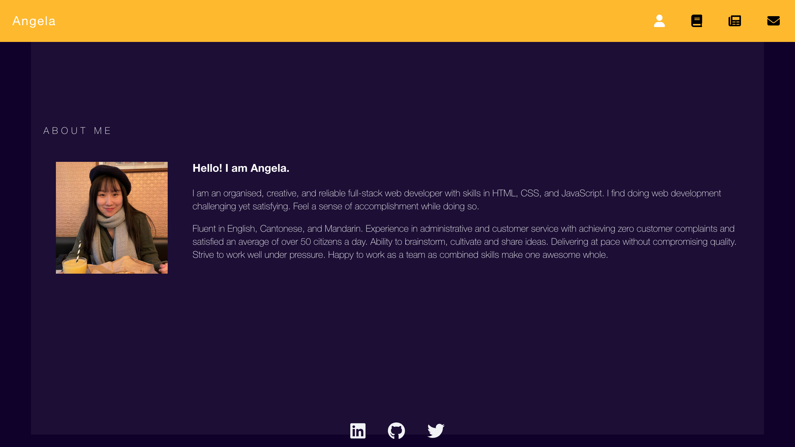

<h1 align="center">My React Portfolio 💻</h1>

<p align="center">
    
    
    
    
    <a href="https://github.com/angelawong3"></a>
</p>

### Overview

```
My react portfolio website with my bio, CV, projects, and contact info.
```



### Technologies used

1. React
2. JavaScript
3. Node
4. CSS

### Link:

Click [https://angelawong3-react-portfolio.herokuapp.com/](https://angelawong3-react-portfolio.herokuapp.com/) to go to the page.

### License

[](https://opensource.org/licenses/MIT)

### Contact Me

Please contact me at angelawong3@yahoo.com

---

© 2022 Angela Wong
